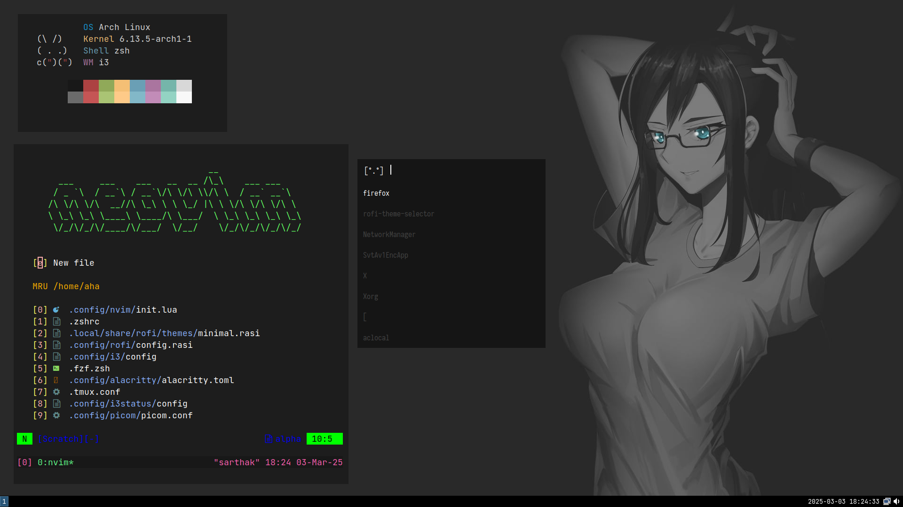

# My Arch Linux Dotfiles 🌿

A collection of my personal dotfiles for Arch Linux, using **i3**, **zsh**, and a minimal yet aesthetic setup.

## Features
- **i3wm** - Tiling window manager
- **zsh + oh-my-zsh** - Customized shell experience
- **Neovim** - Configured for efficient coding
- **Rofi** - A sleek application launcher
- **Picom** - Compositor for transparency & animations
- **Alacritty** - GPU-accelerated terminal emulator

## Installation
Clone the repository and copy the configs:
```bash
git clone https://github.com/ahasarthak/Personal-Dotfiles.git
cd dotfiles
cp -r rofi alacritty gtk-2.0 i3 i3status picom ~/.config/ && cd
cp .zshrc .tmux.conf ~/
```

## Screenshot


---

